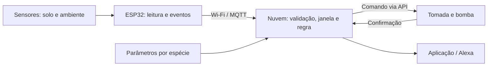

# Não dê nem água 🌱

Sistema de monitoramento e irrigação de plantas em ambientes domésticos, desenvolvido na disciplina **Software para Sistemas Ubíquos**, da Universidade Federal de Goiás (UFG).

O projeto combina informações do solo, do ambiente e da espécie cultivada para orientar o cuidado das plantas, propor alertas e controlar a irrigação.

## Problema e público

Pessoas com rotinas ocupadas podem ter dificuldade para acompanhar as necessidades de plantas de interior. A falta ou o excesso de água e condições inadequadas de luz podem comprometer seu desenvolvimento.

A proposta atende cultivadores domésticos que precisam de acompanhamento das condições dos vasos e assistência para decidir quando intervir.

## Objetivos

- Monitorar umidade do solo, temperatura, umidade do ar e luminosidade.
- Interpretar as medições conforme os parâmetros da espécie e a validade dos dados.
- Automatizar a irrigação com limites de acionamento e confirmação de execução.
- Emitir alertas e recomendações sobre as condições das plantas.
- Tornar falhas e indisponibilidade visíveis, evitando decisões baseadas em leituras obsoletas.

## Estado do projeto

O projeto está na fase de modelagem e prototipação acadêmica. O repositório contém a análise inicial, a arquitetura de processamento e um protótipo individual de validade temporal de leituras.

O protótipo de Bárbara utiliza um potenciômetro para representar umidade fictícia e LEDs para indicar autorização de irrigação e falha. Sua lógica foi verificada por testes locais em C++, incluindo o sketch com interfaces Arduino substituídas. A compilação para ESP32 e a execução dos testes no Wokwi ainda precisam ser confirmadas.

O sistema completo, as integrações comerciais e a irrigação com hardware real permanecem como etapas de desenvolvimento.

## Arquitetura proposta

| Componente | Responsabilidade |
|---|---|
| Sensores por vaso | Coletar umidade do solo e condições ambientais. |
| ESP32 | Amostrar, validar preliminarmente, identificar e encaminhar eventos; manter uma fila durante interrupções. |
| Wi-Fi / MQTT | Transportar os eventos ao backend. |
| Backend em nuvem | Manter histórico e janelas temporais, consultar parâmetros por espécie e decidir a atuação. |
| Tomada inteligente e bomba | Executar comandos de irrigação com duração limitada e confirmação. |
| Aplicação e Alexa | Apresentar informações, alertas e recomendações. |



Na arquitetura completa, a irrigação depende da conectividade e dos serviços em nuvem. Durante sua indisponibilidade, o dispositivo mantém o registro local e novas irrigações automáticas ficam suspensas. A seleção do atuador deve considerar desligamento temporizado e confirmação de execução.

No protótipo individual, a regra é executada no ESP32 para observar o comportamento temporal em simulação. Esse recorte está detalhado na documentação da Atividade 03.

## Documentação das atividades

| Etapa | Conteúdo |
|---|---|
| [Atividade 01](atividade-01.md) | Problema, usuários, contexto, dispositivos, fluxo, classificação e riscos. |
| [Atividade 02](atividade-02.md) | Contratos de eventos, janelas, validade, atrasos, distribuição de responsabilidades e falhas. |
| [Atividade 03](atividade-03/README.md) | Protótipos individuais, execução, testes e organização da entrega. |
| [Divisão de responsabilidades](atividade-03/divisao-de-responsabilidades.md) | Recortes individuais dos integrantes. |
| [Relatório de Bárbara](atividade-03/barbara-nogueira/relatorio.md) | Circuito, contrato de evento, regra temporal, roteiros de teste e limitações. |

## Organização do repositório

```text
.
├── README.md
├── atividade-01.md
├── atividade-02.md
└── atividade-03/
    ├── README.md
    ├── divisao-de-responsabilidades.md
    ├── barbara-nogueira/
    │   ├── sketch.ino
    │   ├── controle.h
    │   ├── diagram.json
    │   ├── relatorio.md
    │   ├── relatorio.pdf
    │   └── evidencias/
    ├── testes/
    ├── gerar_relatorio.py
    └── montar_entrega.py
```

## Executar o protótipo

1. Criar um projeto ESP32 no [Wokwi](https://wokwi.com/projects/new/esp32).
2. Copiar `sketch.ino` e `diagram.json` de `atividade-03/barbara-nogueira/` para as abas correspondentes.
3. Criar o arquivo `controle.h` no editor do Wokwi e copiar seu conteúdo.
4. Iniciar a simulação e observar o monitor serial e os LEDs.

Com a chave à esquerda, o programa coleta amostras; à direita, interrompe a coleta. Três amostras secas consecutivas autorizam a resposta simulada. Ao completar cinco segundos sem uma leitura válida, o sistema preserva o último valor, passa a `DADO_OBSOLETO` e retira a autorização.

As instruções completas e os testes estão no [guia da Atividade 03](atividade-03/README.md). O protótipo não exige bibliotecas adicionais. A pasta `testes/` contém substitutos para execução local e não deve ser copiada para o Wokwi.

## Verificação local

Com `g++` instalado, executar na raiz do repositório:

```bash
g++ -std=c++11 -Wall -Wextra -Werror atividade-03/testes/teste_controle.cpp -o /tmp/naodenemagua-teste-controle
/tmp/naodenemagua-teste-controle

g++ -std=c++11 -Wall -Wextra -Werror -I atividade-03/testes atividade-03/testes/teste_firmware.cpp -o /tmp/naodenemagua-teste-firmware
/tmp/naodenemagua-teste-firmware
```

Esses testes verificam estado normal, autorização, expiração, recuperação e casos de qualidade. Eles não validam o circuito nem substituem a execução no simulador ou em hardware real.

A geração do relatório PDF utiliza Python 3 e ReportLab. O procedimento de montagem da entrega está no guia da Atividade 03.

## Equipe

- Matheus Vieira Mendes Pacheco
- Davi Duarte Neco
- Bárbara Nogueira

**Disciplina:** Software para Sistemas Ubíquos — UFG  
**Professor:** Otávio Calaça Xavier

## Próximas etapas

- Concluir a execução e as evidências dos testes individuais no Wokwi.
- Comparar os protótipos individuais e planejar sua integração.
- Validar sensores, calibração e acionamento com hardware real.
- Implementar a comunicação e o backend conforme os requisitos definidos.
- Avaliar as integrações de atuação e notificação.
