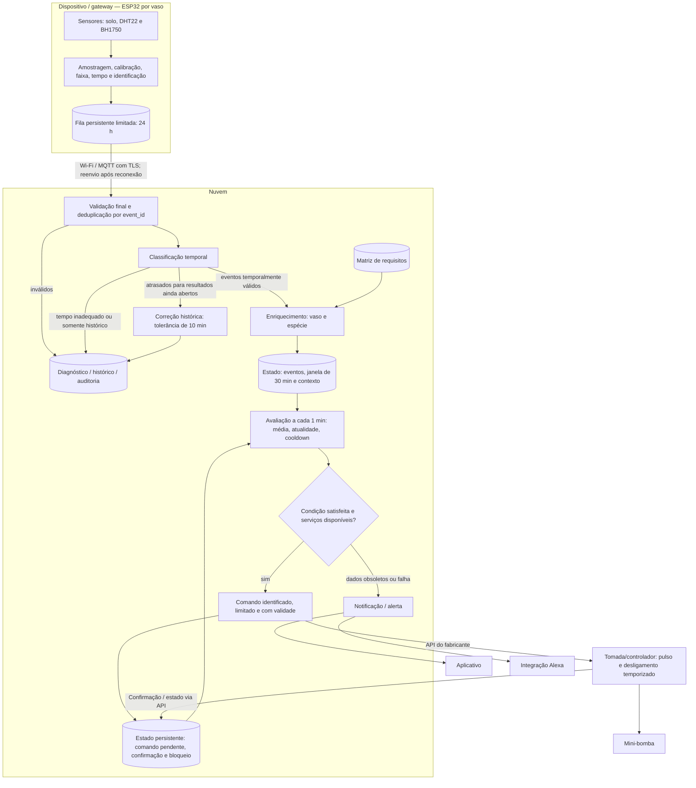

# Software para Sistemas Ubíquos — Atividade em Grupo 02
## Processamento e distribuição de responsabilidades

**Integrantes:**
- Matheus Vieira Mendes Pacheco
- Davi Duarte Neco
- Bárbara Nogueira

**Cenário utilizado:** **Não dê nem água** — monitoramento e irrigação de plantas em ambiente doméstico, conforme a Atividade 01. Sensores conectados a um ESP32 por vaso enviam eventos por Wi-Fi/MQTT a um backend em nuvem. O backend utiliza parâmetros por espécie, controla a bomba por uma tomada inteligente integrada via API e envia notificações ao aplicativo e à Alexa.

**Arquitetura proposta:** a tomada depende da nuvem do fabricante. Sem acesso ao backend ou às APIs, a irrigação automática fica suspensa. Não há regra de irrigação de emergência local nesta proposta. Os intervalos e limites são parâmetros iniciais do projeto e devem ser calibrados conforme a espécie, o substrato e os sensores utilizados.

---

## Parte 1 — Eventos do sistema

### 1. Tipos de evento

- **`LeituraUmidadeSolo`:** amostragem periódica do substrato do vaso, a cada **1 minuto**.
- **`LeituraAmbiente`:** amostragem de temperatura, umidade do ar e luminosidade ao redor do vaso, a cada **5 minutos**.

São ocorrências distintas, mesmo quando produzidas pelo mesmo ESP32. A primeira fornece a condição hídrica; a segunda verifica a disponibilidade de contexto ambiental e ajusta a duração do pulso dentro de limites calibrados por espécie.

### 2. Contrato dos eventos

| Campo | Descrição / contrato |
|---|---|
| `event_type` | `LeituraUmidadeSolo` ou `LeituraAmbiente` |
| `event_id` | UUID único, preservado em todos os reenvios do mesmo evento |
| `device_id` | Identificador do ESP32 produtor |
| `vaso_id` | Entidade observada; deve corresponder ao dispositivo cadastrado |
| `boot_id` | UUID gerado a cada inicialização do ESP32 |
| `seq_num` | Contador crescente por `(device_id, boot_id)`, compartilhado pelos dois tipos; reinicia com uma nova inicialização |
| `timestamp_evento` | Data e hora da amostragem, em ISO 8601 com fuso; relógio sincronizado por NTP |
| `clock_valid` | Indica se o relógio está válido para uso temporal |

| Tipo | Produtor e entidade | Campos específicos e unidades |
|---|---|---|
| `LeituraUmidadeSolo` | ESP32 lendo o higrômetro capacitivo; substrato do `vaso_id` | `umidade_solo_pct`: índice de umidade calibrado entre referências seca e úmida, em %; `tensao_bruta_mv`: leitura bruta em mV |
| `LeituraAmbiente` | ESP32 lendo DHT22 e BH1750; microclima do `vaso_id` | `temperatura_c`: °C; `umidade_ar_pct`: %; `luminosidade_lux`: lux |

O índice do sensor de solo não é apresentado como uma medida universal de saturação ou teor volumétrico de água. Seus limiares dependem da calibração do sensor e do substrato. O sensor de luminosidade adotado é o BH1750, com leituras em lux. A substituição por LDR exigiria revisão do contrato ou calibração.

### 3. Exemplos

```json
{
  "event_type": "LeituraUmidadeSolo",
  "event_id": "a1b2c3d4-5e6f-47a8-9b0c-1d2e3f4a5b6c",
  "device_id": "esp32-vaso-07",
  "vaso_id": "vaso-07",
  "boot_id": "bf784f76-8124-4d55-8f84-963a95592eaa",
  "seq_num": 4821,
  "timestamp_evento": "2026-09-11T14:32:05-03:00",
  "clock_valid": true,
  "umidade_solo_pct": 18.4,
  "tensao_bruta_mv": 2130
}
```

```json
{
  "event_type": "LeituraAmbiente",
  "event_id": "f9e8d7c6-4b3a-4c2d-8e1f-0a9b8c7d6e5f",
  "device_id": "esp32-vaso-07",
  "vaso_id": "vaso-07",
  "boot_id": "bf784f76-8124-4d55-8f84-963a95592eaa",
  "seq_num": 4822,
  "timestamp_evento": "2026-09-11T14:32:10-03:00",
  "clock_valid": true,
  "temperatura_c": 29.8,
  "umidade_ar_pct": 41.2,
  "luminosidade_lux": 8600
}
```

### 4. Qualidade

- **Inválido:** rejeitar campos obrigatórios ausentes, tipos incorretos, valores não finitos, origem desconhecida ou associação dispositivo/vaso incorreta. Aplicar faixas iniciais de plausibilidade: solo e umidade do ar em `[0, 100]`, temperatura em `[-10, 60]` °C, luz em `[0, 65000]` lux e tensão bruta dentro da faixa configurada do circuito. Fora da faixa indica uma leitura inadequada para decisão, cuja causa será investigada; não prova um defeito específico.
- **Duplicado:** reconhecer pelo `event_id` já registrado em armazenamento com unicidade. O ESP32 preserva o ID ao reenviar. Sequência menor que a maior recebida significa possível chegada fora de ordem, não duplicação. `boot_id` diferencia reinicializações.
- **Tempo inadequado:** eventos sem relógio válido ou com tempo mais de 30 segundos no futuro são separados para diagnóstico, sem atuação. O dispositivo não transmite leituras como temporalmente válidas antes de sincronizar seu relógio após reiniciar.
- **Desatualizado para atuação:** última leitura do solo com idade superior a **2 minutos**, ou última leitura de ambiente com idade superior a **10 minutos**, impede irrigação. Isso é diferente de pertencer a uma janela histórica.
- **Atrasado:** evento recebido depois de uma avaliação à qual pertence segue a política do item 8. Pode corrigir uma média histórica sem ser válido para comandar a bomba no presente.

---

## Parte 2 — Processamento temporal

### 5. Operações

```text
Eventos → validação de schema/origem/faixa/tempo → deduplicação por event_id
       → classificação temporal → enriquecimento por espécie
       → agrupamento por vaso_id → janela/agregação
       → verificação de validade e condição → decisão
       → comando limitado + confirmação de execução → notificação

Eventos inválidos ou temporalmente inadequados → diagnóstico
Eventos além da tolerância de correção → histórico/auditoria
```

### 6. Estado e janela

**Regra:** irrigar quando a média recente de umidade indicar solo seco, com dados atuais, parâmetros disponíveis, conectividade e condições de controle satisfeitas.

- **Janela deslizante:** últimos **30 minutos**, avaliada a cada **1 minuto** pelo relógio do backend. Para cada instante de avaliação `t`, a janela é `(t − 30 min, t]`, usando o tempo de ocorrência de cada evento.
- **Amostras mínimas:** três leituras distintas do solo na janela. É um mínimo inicial; a cobertura exigida poderá ser ajustada após avaliação dos sensores.
- **Estado por vaso:** eventos do solo dos últimos 40 minutos (30 de janela + 10 de correção), última leitura de ambiente por tempo do evento, resultados das avaliações corrigíveis e seu instante `t`, identificação de eventos processados, parâmetros/versionamento da espécie, último instante de irrigação confirmada, comando pendente e eventual bloqueio por execução incerta.
- **Expiração:** o agendador remove dados e resultados fora da retenção, mesmo sem novos eventos. Sem leituras atuais, a situação é desconhecida e a bomba não é acionada.
- **Persistência:** comandos, confirmações, cooldown, bloqueios e deduplicação são persistidos. A identificação de eventos também é preservada no histórico para reconhecer reenvios antigos.

### 7. Semântica temporal

A pertença à janela e a seleção da última leitura usam **tempo do evento**. O relógio de processamento apenas agenda avaliações e mede a idade atual dos dados, o cooldown e o timeout de comandos.

Isso impede que leituras acumuladas durante uma queda de conexão sejam interpretadas como medições simultâneas na reconexão. O relógio do dispositivo precisa estar válido; caso contrário, o evento vai para diagnóstico.

### 8. Eventos atrasados

Para cada avaliação produzida no instante `t`, o resultado permanece corrigível por **10 minutos**, até `t + 10 min`. Eventos recebidos nesse período podem corrigir o agregado das avaliações às quais pertencem. Após o prazo, são mantidos no histórico sem alterar esses resultados.

Adotamos a fronteira temporal operacional **`W = agora_backend − 10 min`**: resultados com término `t < W` são considerados encerrados para correção. Essa fronteira, equivalente a uma estimativa de progresso baseada em atraso tolerado, avança mesmo com sensor silencioso; não garante que todos os eventos antigos chegaram. Os **10 minutos são a tolerância de correção**, e `W` é a fronteira usada para encerrar resultados.

- **Dentro da tolerância:** aceitar o evento e corrigir os resultados históricos ainda abertos aos quais ele pertence.
- **Além da tolerância de um resultado:** separar para histórico, sem corrigir esse resultado. O mesmo evento ainda pode pertencer a uma janela mais recente.
- **Para a atuação atual:** qualquer evento válido que pertença à janela atual pode compor sua média, mas só dados atuais autorizam atuação. Uma correção histórica nunca dispara um comando retroativo.
- **Após irrigação executada:** preservar o registro da atuação; correções não desfazem água aplicada. Cooldown, comando pendente e confirmação impedem repetição indevida.

Exemplo: a janela avaliada às 14h30 considera eventos entre 14h00 e 14h30. Uma leitura das 14h29 recebida às 14h35 pode corrigir essa média. A mesma leitura recebida às 14h42 não corrige o resultado das 14h30, mas pode compor a janela atual (14h12, 14h42]. Sozinha, ela não autoriza irrigação, pois não atende à atualidade exigida para o solo.

### 9. Pseudocódigo

```text
ESTADO persistente por vaso:
    eventos_solo, ultima_leitura_ambiente, resultados_corrigiveis
    ids_processados, ultima_irrigacao_confirmada
    comando_pendente, bloqueio_execucao_incerta, requisitos_especie

AO RECEBER evento e:
    SE schema/origem/faixa invalidos:
        registrar_diagnostico(e); RETORNAR
    SE e.event_id ja registrado:
        RETORNAR
    registrar_evento_unico(e)   // registro e atualização do estado são atômicos
    SE NAO e.clock_valid OU e.timestamp_evento > agora() + 30s:
        separar_para_diagnostico(e); RETORNAR

    armazenar_no_historico(e)
    SE e.event_type == "LeituraUmidadeSolo":
        SE e.timestamp_evento > agora() - 40min:
            inserir_ordenado(eventos_solo[e.vaso_id], e)
        PARA resultado de solo com fim t >= agora() - 10min:
            SE t - 30min < e.timestamp_evento <= t:
                corrigir_media_historica(resultado, e)
                // não emite comando retroativo

    SE e.event_type == "LeituraAmbiente":
        SE ultima_leitura_ambiente == null
           OU e.timestamp_evento > ultima_leitura_ambiente.timestamp_evento:
            ultima_leitura_ambiente[e.vaso_id] = e

A CADA 1 MINUTO, PARA CADA vaso, no instante t = agora():
    expirar eventos com tempo <= t - 40min
    encerrar resultados com fim < t - 10min
    janela = eventos_solo[vaso] com t - 30min < timestamp_evento <= t
    ambiente = ultima_leitura_ambiente[vaso]
    req = requisitos_especie[vaso]
    SE req ausente OU tamanho(janela) < 3:
        registrar_situacao_desconhecida(); CONTINUAR

    media_solo = media(janela.umidade_solo_pct)
    registrar_resultado_corrigivel(t, media_solo)
    solo_atual = t - max(janela.timestamp_evento) <= 2min
    ambiente_atual = ambiente != null
                    E 0 <= t - ambiente.timestamp_evento <= 10min
    SE NAO solo_atual OU NAO ambiente_atual:
        emitir_alerta_sem_repeticao("dados_desatualizados"); CONTINUAR

    SE comando_pendente != null OU bloqueio_execucao_incerta:
        CONTINUAR
    cooldown_ok = ultima_irrigacao_confirmada == null
                  OU t - ultima_irrigacao_confirmada >= req.cooldown_min minutos
    SE media_solo < req.umidade_min E cooldown_ok E servicos_disponiveis():
        // req possui limiares e durações calibrados, não universais
        duracao = req.pulso_base_seg
        SE ambiente.temperatura_c > req.temperatura_alta_c
           E ambiente.luminosidade_lux > req.luz_alta_lux:
            duracao = req.pulso_contexto_quente_seg
        duracao = limitar(duracao, req.pulso_min_seg, req.pulso_max_seg)
        cmd = novo_comando(id_unico, vaso, duracao, validade=60s)
        persistir_comando_pendente(cmd) // antes de enviar
        enviar_comando_limitado(cmd)

AO RECEBER confirmação autenticada e correspondente ao comando:
    SE execução concluída, bomba desligada e horário de execução válido:
        ultima_irrigacao_confirmada = horário confirmado da execução
        limpar_comando_pendente()
        notificar_usuario()
    SE falha confirmada sem aplicação de água:
        limpar_comando_pendente(); registrar_falha()

SE nenhuma confirmação conclusiva em 60s OU execução parcial/incerta:
    bloqueio_execucao_incerta = verdadeiro
    emitir_alerta_sem_repeticao("verificar_bomba")
    // Não reenviar automaticamente. Consultar estado e registros;
    // se não houver evidência conclusiva, exigir verificação do usuário.
```

**Contrato de atuação assumido:** cada pulso tem identificador, duração máxima e validade; comandos expirados não são executados. A integração deve impedir repetição do mesmo comando, confirmar a execução e garantir desligamento temporizado no atuador, mesmo se a conexão cair após ligar. Esses recursos precisam ser verificados na escolha da tomada/controlador; sem eles, a irrigação automática proposta não deve ser habilitada. Confirmar execução elétrica não comprova fluxo de água, cuja verificação exigiria instrumentação adicional.

---

## Parte 3 — Distribuição e resiliência

### 10. Distribuição de responsabilidades

São utilizados **dispositivo e nuvem**. O ESP32 também exerce o papel de gateway ao encaminhar os eventos; não mantém a janela nem decide irrigação. Não há nó de borda de decisão ou camada de névoa nesta hipótese.

| Responsabilidade / estado | Local |
|---|---|
| Amostragem, calibração, validação preliminar e tempo | Dispositivo: ESP32 |
| Identificação e fila persistente de eventos para reenvio | Dispositivo: ESP32 |
| Transporte de eventos para o backend | Gateway: o mesmo ESP32, via Wi-Fi/MQTT |
| Validação final, deduplicação e classificação temporal | Nuvem |
| Janela, resultados corrigíveis e último contexto ambiental | Nuvem |
| Matriz/versionamento de requisitos por espécie | Nuvem |
| Regra, comando pendente, cooldown e bloqueio por incerteza | Nuvem, com estado persistente |
| Integrações, notificações, histórico e auditoria | Nuvem |
| Execução do pulso e desligamento temporizado | Atuador/controlador da bomba, com temporização local |

A temporização local limita um comando já recebido; não constitui uma regra de irrigação por sensores. Essa função é executada pelo controlador do atuador, sem uma camada separada de processamento de borda.

### 11. Justificativas

**a) Validação preliminar e fila no ESP32 — volume e conectividade.** Comparações simples permitem separar leituras inadequadas antes de enviar telemetria normal, transmitindo diagnóstico resumido. A fila mantém eventos durante interrupções e permite recuperação do histórico. Não há deduplicação de medições físicas diferentes: reenvios preservam o mesmo ID.

**b) Janela, matriz e regra na nuvem — gestão centralizada e integração.** O backend reúne histórico de vários vasos, atualiza parâmetros por espécie e mantém as integrações com aplicativo e serviços externos em um único lugar. A centralização simplifica a organização e a manutenção dos parâmetros e das integrações. A latência de minutos é compatível com a regra modelada, mas a disponibilidade de irrigação depende da rede. A arquitetura proposta admite suspensão da irrigação durante indisponibilidade da rede. Um requisito futuro de autonomia offline exigirá decisão e controle em um componente local.

### 12. Comportamento diante de falhas

**Falha escolhida:** internet ou backend indisponível, mesmo com a rede Wi-Fi doméstica funcionando.

1. O ESP32 continua coletando e armazena eventos válidos em fila persistente com capacidade inicial para **24 horas** na taxa definida. Ao esgotar a capacidade, remove os mais antigos e registra a perda; não promete retenção ilimitada.
2. O reenvio usa backoff e preserva ID e tempo originais. Após reiniciar, um novo `boot_id` distingue a sequência; até sincronizar o relógio, leituras vão para diagnóstico e não são usadas na regra.
3. **Não são iniciadas novas irrigações automáticas durante a indisponibilidade.** O monitoramento local e o registro continuam, mas alertas remotos podem ficar indisponíveis. O usuário deverá realizar a irrigação manual quando necessário.
4. Se a falha ocorrer durante um pulso já iniciado, a temporização do atuador garante desligamento. Sem confirmação, o backend mantém a execução como incerta e bloqueia novos comandos até reconciliar o estado.
5. Na reconexão, eventos antigos seguem a política temporal. A retomada exige leituras atuais de solo e ambiente, estado de comandos reconciliado e cooldown respeitado. O aplicativo recebe um resumo do período offline e das perdas de dados.

### 13. Diagrama


