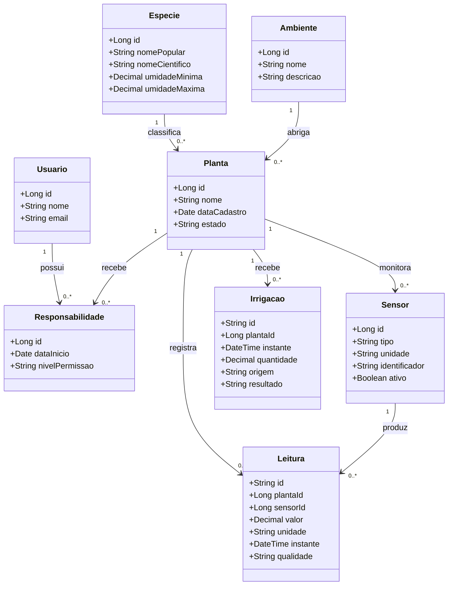

# Proposta inicial — Projeto de persistência de dados

## Equipe

| Nome completo | Username do GitHub |
|---|---|
| Bárbara Nogueira | A confirmar |
| Davi Duarte Neco | A confirmar |

## Tema do projeto

**Não dê nem água — Sistema de gerenciamento e monitoramento de cuidados com plantas**

O sistema permitirá cadastrar usuários, plantas, espécies, ambientes e sensores. Também armazenará leituras de umidade, temperatura e luminosidade, além de registrar irrigações. Uma interface desktop permitirá administrar os dados principais, enquanto uma API JSON permitirá gerenciar leituras e eventos armazenados em um banco orientado a documentos.

O protótipo com ESP32 e Wokwi poderá ser utilizado como uma fonte simulada de leituras. O foco deste projeto será a persistência, a consulta, a integração e a validação dos dados.

## Aplicação dos conceitos

| Conceito | Aplicação no projeto |
|---|---|
| Entidades | Usuário, planta, espécie, ambiente, responsabilidade, sensor, leitura e irrigação. |
| Relação 1:N | Uma espécie pode classificar várias plantas; uma planta pode possuir vários sensores, leituras e registros de irrigação. |
| Relação N:N | Vários usuários podem cuidar de várias plantas, por meio da entidade associativa `Responsabilidade`. |
| ORM relacional | Persistência de usuários, plantas, espécies, ambientes, sensores e responsabilidades. |
| MVC desktop | Interface para cadastrar, consultar, editar e excluir os dados armazenados pela camada ORM. |
| ODM documental | Persistência de leituras dos sensores e eventos de irrigação em documentos. |
| Backend JSON | API para realizar operações CRUD sobre os documentos armazenados pela camada ODM. |
| Integrador | Middleware que associa as plantas e os sensores do banco relacional às leituras e irrigações do banco documental. |
| Testes unitários | Verificação dos cadastros, relacionamentos, validações, consultas e operações das camadas de persistência. |

## Distribuição preliminar dos dados

### Banco de dados relacional

O banco relacional armazenará informações estruturadas e relacionamentos consistentes:

- usuários;
- plantas;
- espécies;
- ambientes;
- sensores;
- responsabilidades dos usuários sobre as plantas.

### Banco de dados orientado a documentos

O banco documental armazenará dados gerados ao longo do tempo e que podem ocorrer em grande quantidade:

- leituras de umidade do solo;
- leituras de temperatura;
- leituras de luminosidade;
- eventos de irrigação;
- informações de qualidade e validade das leituras.

## Diagrama de classes preliminar

A relação N:N entre `Usuario` e `Planta` é representada pela entidade associativa `Responsabilidade`. Dessa forma, um usuário pode cuidar de várias plantas e uma planta pode ser cuidada por várias pessoas.

## Observação

Esta é uma modelagem inicial e poderá ser ajustada após a apresentação dos requisitos completos, das tecnologias obrigatórias e dos critérios de avaliação da disciplina.
